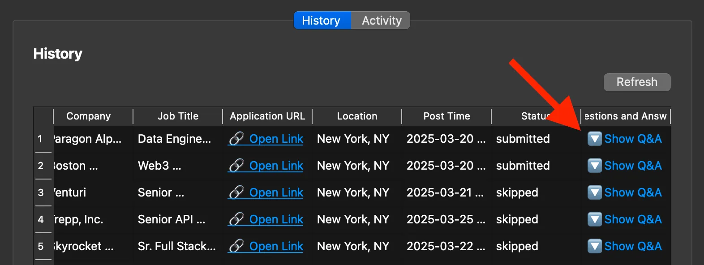
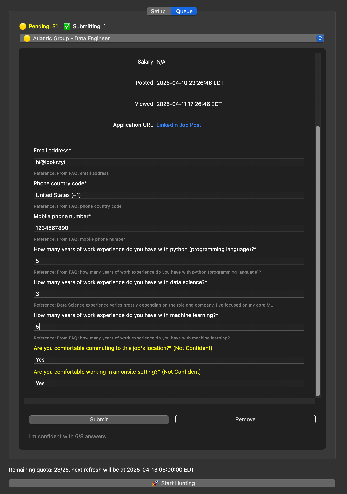

## FAQ

- **Q: Can you apply to all jobs on LinkedIn?**

  JobHuntr applies to all jobs with the “Easy Apply” option on LinkedIn (about 70% of jobs).

- **Q: Does it work for all job types?**

  Yes!

- **Q: How many jobs can I apply to per day?**

  Up to **25** applications daily.

- **Q: How can I check the questions that were previously filled out?**

  Go to the **History** tab and scroll all the way to the right. Click on **“Show Q&A”** to view the details of previously answered questions.

  

- **Q: Will my Linkedin account be banned?**

  No. All actions are designed to mimic human behavior, with built-in randomness. Additionally, all requests are sent from your own IP address, making it extremely difficult for LinkedIn to detect any automation.

- **Q: Why should I trust the AI’s filling?**

  You can choose to save all jobs to the “Queue” and mark them by confidence. The more questions you submit, the smarter it gets. Eventually, it will build your trust and confidence.

  

- **Q: Why is my on-device AI getting stuck on a question?**

  If you choose a model larger than 4B, some personal laptops may struggle to run it efficiently or experience significant slowdowns—especially when processing long input contexts, such as resumes. The initial response time can be particularly slow, but performance typically improves as the model continues running.

- **Q: Which countries are supported?**

  Currently, JobHuntr supports job searches in the following countries:
  - United States
  - Canada
  - Australia
  - United Kingdom

- **Q: Which cities are supported?**

  JobHuntr supports major cities in each country:

  **United States:**
  - New York, NY
  - Houston, TX
  - Chicago, IL
  - Atlanta, GA
  - Los Angeles, CA
  - Dallas, TX
  - Austin, TX
  - Boston, MA
  - Seattle, WA
  - Charlotte, NC
  - Portland, OR
  - San Francisco, CA

  **Canada:**
  - Toronto, ON
  - Vancouver, BC
  - Montreal, QC
  - Calgary, AB
  - Ottawa, ON

  **Australia:**
  - Sydney, NSW
  - Melbourne, VIC
  - Brisbane, QLD
  - Perth, WA

  **United Kingdom:**
  - London
  - Birmingham
  - Manchester
  - Liverpool

- **Q: Will it automatically follow all companies that I applied?**

  No, it will uncheck the follow option before submission by default.
