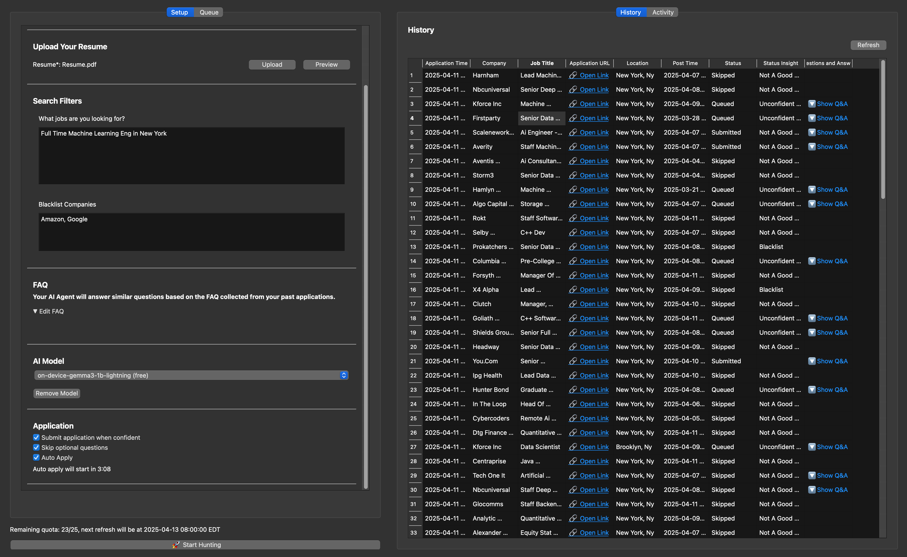

## Setup on Apple Silicon (M1 to M3)

1. **System Language**: Please make sure your macOS system language is set to **English**. (This ensures LinkedIn opens in English.)
2. **Download**: Get the latest version here: [Download Link](https://github.com/lookr-fyi/job-application-bot-by-ollama-ai/releases/latest/download/JobHuntr-arm64.dmg)
3. **Install:** Drag and drop the app into your **/Applications** folder.

   

   - If it doesn’t appear in Launchpad, open it via **Finder**.

     

4. **Login:** Launch the app, enter your LinkedIn email, and click **“Open LinkedIn.”** Sign in to your LinkedIn account in the browser window that opens. Since Chromium doesn’t allow Google OAuth, Please use email to sign in instead of google. Once you're logged in, the browser will close automatically, and you'll be redirected to the Jobhuntr home page.

   

5. **Start Application:** Once you’ve filled in all the required fields marked in red, you’ll be ready to start your first application. Enjoy!

   
