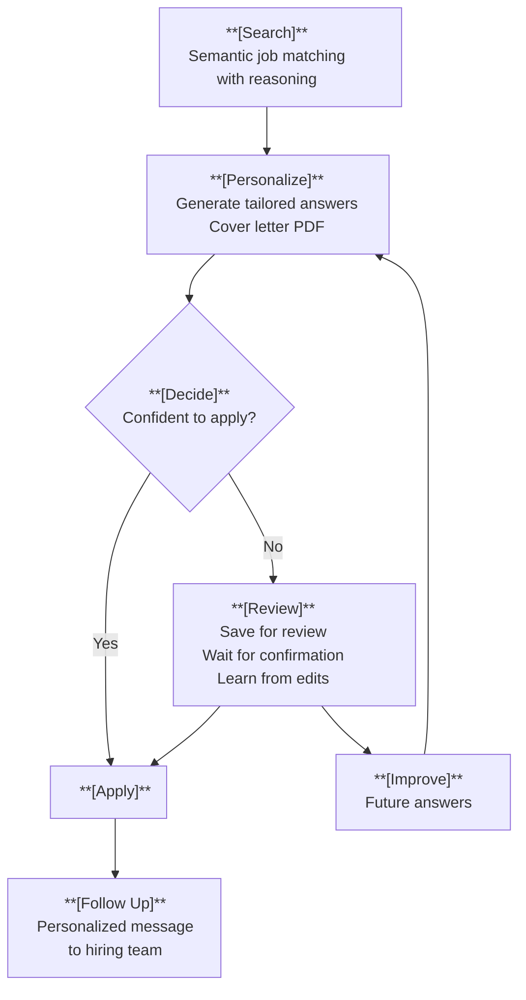
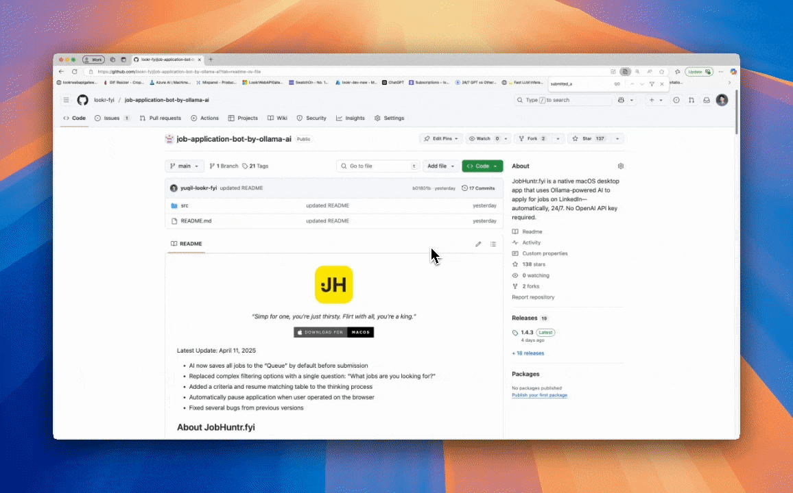

<i>“What is most personal is most universal. - Carl Rogers”</i>

  

Latest Update: April 20, 2025

- [New Feature] Cover letter generation
- [New Feature] Send a personalized note to the hiring team after applying
- [Improvement] Support a new country - Australia
- [Improvement] Humanized page browsing behavior

## About JobHuntr.fyi

  <a href="./SETUP.md"><strong> Setup Tutorial </strong></a> •
  <a href="./FAQ.md"><strong> FAQ </strong></a> •
  <a href="#features"><strong>Features</strong></a> •
  <a href="#star-us"><strong>Support Us</strong></a>

JobHuntr.fyi is an on-device AI bot that filters and applies for jobs with high personalization at scale.

## Demo

<!-- sample cover letter -->

Click to view [Generated sample cover letter](src/sample_cover_letter.pdf)

## Features

| ✅ Feature               | 💡 Description                                                                        | Free Plan | Premium Plan ($9.99/mo) |
| ------------------------ | ------------------------------------------------------------------------------------- | :-------: | :---------------------: |
| 🎯 Auto Apply            | Automatically applies to new jobs 24/7 in the background.                             |    ✅     |           ✅            |
| 🔄 Review before submit  | Applications can be saved to the “Queue” before submission.                           |    ✅     |           ✅            |
| 🧠 Smart Filtering       | Skips jobs that don’t match your resume and custom filters.                           |    ✅     |           ✅            |
| 🚫 Company Blacklist     | Exclude specific companies from job applications. Defaults to your past employers.    |    ✅     |           ✅            |
| 📎 Show References       | Every answered question is backed by content from your resume or FAQs.                |    ✅     |           ✅            |
| 🤖 On-Device AI          | All AI runs locally via Ollama. Fast, secure, and private.                            |    ✅     |           ✅            |
| 📊 Progress Tracking     | Saves application history and tracks which FAQs you've seen or answered.              |    ✅     |           ✅            |
| ⏭️ Skip Questions        | Automatically skips optional or non-critical application questions.                   |    ✅     |           ✅            |
| ⏸️ Pause/Resume          | Start or stop the auto-apply agent at any time.                                       |    ✅     |           ✅            |
| 📄 Generate cover letter | Generate a personalized cover letter for all applications that require one.           |    ❌     |           ✅            |
| 📧 DM to hiring team     | Send a personalized note to the hiring team after applying.                           |    ❌     |           ✅            |
| 🧾 AI Reasoning          | View the AI's step-by-step decision-making for each application.                      |    ❌     |           ✅            |
| ⚡ Cloud AI              | Uses a faster cloud-based AI model with improved matching and answering capabilities. |    ❌     |           ✅            |

## Star Us

We need your help to increase the visibility of JobHuntr.fyi and enable more job seekers to land their dream jobs.

## Contact

We’d love your feedback!

📧 Email: hi@lookr.fyi
