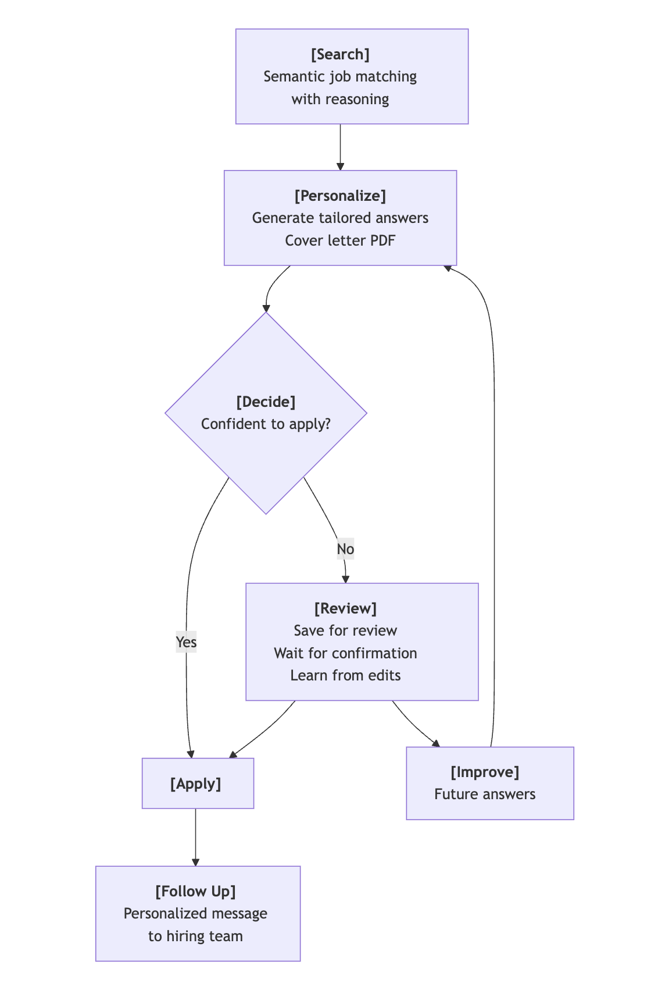

<i>"Resume in. Interviews out — 100% Hand-free."</i>

<!-- add spacing between the two images -->

  
  

Latest Update: May 25, 2025

- [New Feature]: Integrated ATS scoring into the job evaluation process and job submission queue. ([TikTok Demo](https://www.tiktok.com/@yuqili657/video/7508559462077041926))
- [New Feature]: Allowed to sort history table columns from A to Z. ([TikTok Demo](https://www.tiktok.com/@yuqili657/video/7510074106956532998))
- [UX Improvement]: Enhanced job matching based on your prompt in “What jobs are you looking for?”

## About JobHuntr.fyi

  <a href="./MAC_SETUP.md"><strong> MacOS Tutorial </strong></a> •
  <a href="./WIN_SETUP.md"><strong> Windows Tutorial </strong></a> •
  <a href="./FAQ.md"><strong> FAQ </strong></a> •
  <a href="./USER_LETTER.md"><strong>User Letter</strong></a> •
  <a href="./PLATFORM_LETTER.md"><strong>Platform Letter</strong></a> •
  <a href="./PRICING.md"><strong>Pricing</strong></a> •
  <a href="https://www.tiktok.com/@yuqili657"><strong>TikTok</strong></a>

JobHuntr.fyi is an on-device AI bot that filters and applies for jobs with high personalization at scale. Quality first. No spam.

## Demo

<!-- sample cover letter -->

Click to view [Generated sample cover letter](src/sample_cover_letter.pdf)

## Features

| ✅ Feature               | 💡 Description                                                                        |
| ------------------------ | ------------------------------------------------------------------------------------- |
| 🎯 Auto Apply            | Automatically applies to new jobs 24/7 in the background.                             |
| 🔄 Review before submit  | Applications can be saved to the "Queue" before submission.                           |
| 🧠 Smart Filtering       | Skips jobs that don't match your resume and custom filters.                           |
| 🚫 Company Blacklist     | Exclude specific companies from job applications. Defaults to your past employers.    |
| 📎 Show References       | Every answered question is backed by content from your resume or FAQs.                |
| 🤖 On-Device AI          | All AI runs locally via Ollama. Fast, secure, and private.                            |
| 📊 Progress Tracking     | Saves application history and tracks which FAQs you've seen or answered.              |
| ⏭️ Skip Questions        | Automatically skips optional or non-critical application questions.                   |
| ⏸️ Pause/Resume          | Start or stop the auto-apply agent at any time.                                       |
| 📄 Generate cover letter | Generate a personalized cover letter for all applications that require one.           |
| 📧 DM to hiring team     | Send a personalized note to the hiring team after applying.                           |
| 🧾 AI Reasoning          | View the AI's step-by-step decision-making for each application.                      |
| ⚡ Cloud AI              | Uses a faster cloud-based AI model with improved matching and answering capabilities. |

## Star Us

We need your help to increase the visibility of JobHuntr.fyi and enable more job seekers to land their dream jobs.

## Contact

We'd love your feedback!

📧 Email: hi@lookr.fyi
