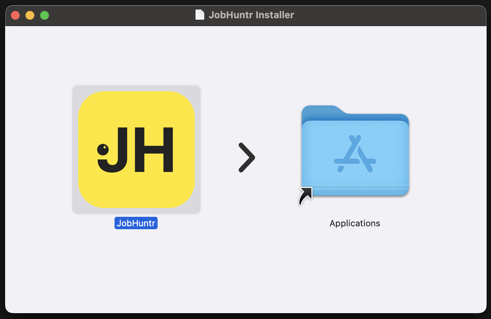
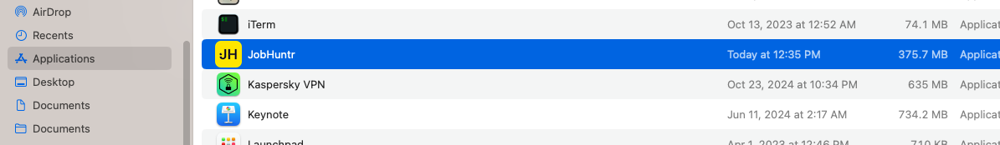

<i>“Simp for one, you’re just thirsty. Flirt with all, you’re a king.”</i>

  <strong>
    📊 From April 11–17, we reviewed <ins>7,358</ins> jobs and submitted <ins>366</ins> for our users.
  </strong>

  

Latest Update: April 11, 2025

- AI now saves all jobs to the “Queue” by default before submission
- Replaced complex filtering options with a single question: “What jobs are you looking for?”
- Added a criteria and resume matching table to the thinking process
- Automatically pause application when user operated on the browser
- Fixed several bugs from previous versions

## About JobHuntr.fyi

JobHuntr.fyi is a macOS desktop app that uses Ollama-powered AI to apply for jobs on LinkedIn—automatically, 24/7. No OpenAI API key required.

## Setup on Apple Silicon (M1 to M3)

1. **System Language**: Please make sure your macOS system language is set to **English**. (This ensures LinkedIn opens in English.)
2. **Download**: Get the latest version here: [Download Link](https://github.com/lookr-fyi/homebrew-jobhuntr/releases/latest/download/JobHuntr.dmg)
3. **Install:** Drag and drop the app into your **/Applications** folder.

   

   - If it doesn’t appear in Launchpad, open it via **Finder**.

     

4. **Login:** Launch the app, enter your LinkedIn email, and click **“Open LinkedIn.”** Sign in to your LinkedIn account in the browser window that opens. Since Chromium doesn’t allow Google OAuth, Please use email to sign in instead of google. Once you're logged in, the browser will close automatically, and you'll be redirected to the Jobhuntr home page.

   

5. **Start Application:** Once you’ve filled in all the required fields marked in red, you’ll be ready to start your first application. Enjoy!

   

## Features

| ✅ Feature              | 💡 Description                                                                        | Free Plan | Premium Plan ($9.99/mo) |
| ----------------------- | ------------------------------------------------------------------------------------- | :-------: | :---------------------: |
| 🎯 Auto Apply           | Automatically applies to new jobs 24/7 in the background.                             |    ✅     |           ✅            |
| 🔄 Review before submit | Applications can be saved to the “Queue” before submission.                           |    ✅     |           ✅            |
| 🧠 Smart Filtering      | Skips jobs that don’t match your resume and custom filters.                           |    ✅     |           ✅            |
| 🚫 Company Blacklist    | Exclude specific companies from job applications. Defaults to your past employers.    |    ✅     |           ✅            |
| 📎 Show References      | Every answered question is backed by content from your resume or FAQs.                |    ✅     |           ✅            |
| 🤖 On-Device AI         | All AI runs locally via Ollama. Fast, secure, and private.                            |    ✅     |           ✅            |
| 📊 Progress Tracking    | Saves application history and tracks which FAQs you've seen or answered.              |    ✅     |           ✅            |
| ⏭️ Skip Questions       | Automatically skips optional or non-critical application questions.                   |    ✅     |           ✅            |
| ⏸️ Pause/Resume         | Start or stop the auto-apply agent at any time.                                       |    ✅     |           ✅            |
| 🧾 AI Reasoning         | View the AI's step-by-step decision-making for each application.                      |    ❌     |           ✅            |
| ⚡ Cloud AI             | Uses a faster cloud-based AI model with improved matching and answering capabilities. |    ❌     |           ✅            |

## Support Us

We’d really appreciate it if you could show your support by giving our repo a star. If you find it helpful, feel free to share it with your friends too—it would mean a lot to us! 😊

## FAQ

- **Q: Can you apply to all jobs on LinkedIn?**

  JobHuntr applies to all jobs with the “Easy Apply” option on LinkedIn (about 70% of jobs).

- **Q: Does it work for all job types?**

  Yes!

- **Q: How many jobs can I apply to per day?**

  Up to **25** applications daily. Want more? Reach out to us.

- **Q: How can I check the questions that were previously filled out?**

  Go to the **History** tab and scroll all the way to the right. Click on **“Show Q&A”** to view the details of previously answered questions.

  

- **Q: Will my Linkedin account be banned?**

  No. All actions are designed to mimic human behavior, with built-in randomness. Additionally, all requests are sent from your own IP address, making it extremely difficult for LinkedIn to detect any automation.

- **Q: Why should I trust the AI’s filling?**

  By default, the AI saves all jobs to the “Queue” and marks them by confidence. The more questions you submit, the smarter it gets.

  

- **Q: Why is my on-device AI getting stuck on a question?**

  If you choose a model larger than 4B, some personal laptops may struggle to run it efficiently or experience significant slowdowns—especially when processing long input contexts, such as resumes. The initial response time can be particularly slow, but performance typically improves as the model continues running.

- **Q: Will it automatically follow all companies that I applied?**

  No, it will uncheck the follow option before submission by default.

## Contact

We’d love your feedback!

📧 Email: hi@lookr.fyi
