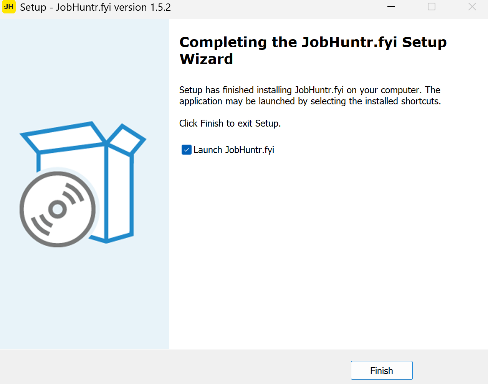
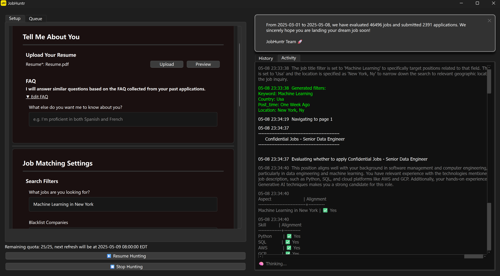

## Setup on Windows

1. **System Language**: Please make sure your Windows system language is set to **English**. (This ensures LinkedIn opens in English.)

2. **Download**: Get the latest version here: [Download Link](https://jobhuntr.fyi/download/windows)

3. **Install**: 
   - Run the downloaded `JobHuntr-Setup.exe` file
   - Follow the installation wizard
   - The application will be installed in your default Programs directory

   

4. **Login**: 
   - Launch the app from your Start menu or desktop shortcut
   - Enter your LinkedIn email and click **"Open LinkedIn"**
   - Sign in to your LinkedIn account in the browser window that opens
   - Since Chromium doesn't allow Google OAuth, please use email to sign in instead of Google
   - Once you're logged in, the browser will close automatically, and you'll be redirected to the Jobhuntr home page

   

5. **Start Application**: Once you've filled in all the required fields marked in red, you'll be ready to start your first application. Enjoy!

    